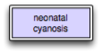
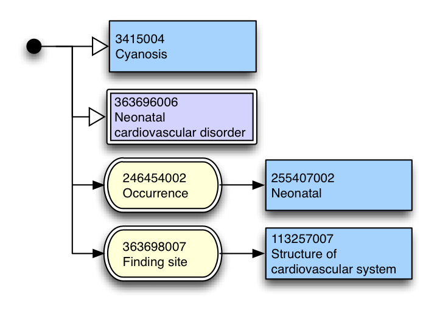

# 3.1 Expression Diagrams

<figure><figcaption>
Figure 3.1-1: Simple expression diagram
</figcaption></figure>

Expression diagrams are the most general form of diagram, which represent a SNOMED CT expression as defined in the SNOMED CT Compositional Grammar. Diagrams representing expressions may exist on their own, or be part of a larger diagram representing a concept definition or relation between two expressions.

In its simplest form this may simply be a single concept

<figure><figcaption>
Figure 3.1-2: Diagram of the single concept INLINE95617006 | Neonatal cyanosis |
</figcaption></figure>

In more complex scenarios diagrams may represent coordination of attribute types, concepts and concrete values.

<figure><figcaption>
Figure 3.1-3: <em>Ref347406127Figure 4 Expression equivalentINLINEEquivalent as at the January 2012 SNOMED CT International release.</em>toINLINE95617006 | Neonatal cyanosis |
</figcaption></figure>

In all expressions other than a single concept value[1](https://confluence.ihtsdotools.org/display/DOCDIAG/3.1+Expression+Diagrams#Footnote1 "Footnote: Click here to display the footnote") it is necessary to start the diagram with a conjunction dot.

* * *

Footnotes Ref | Notes  
---|---  
[1](https://confluence.ihtsdotools.org/display/DOCDIAG/3.1+Expression+Diagrams#FootnoteMarker1-0 "Footnote: Click to return to reference in text") |  An example of an expression is shown in Figure 4, whereas a single concept value is shown in Figure 3 
