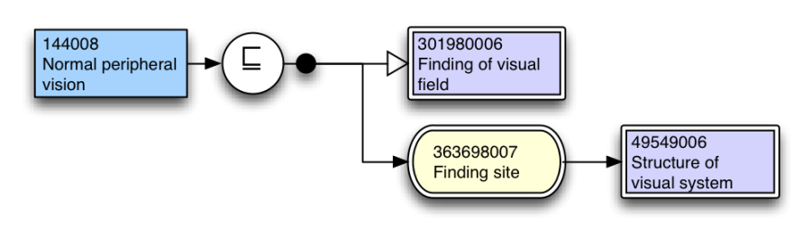
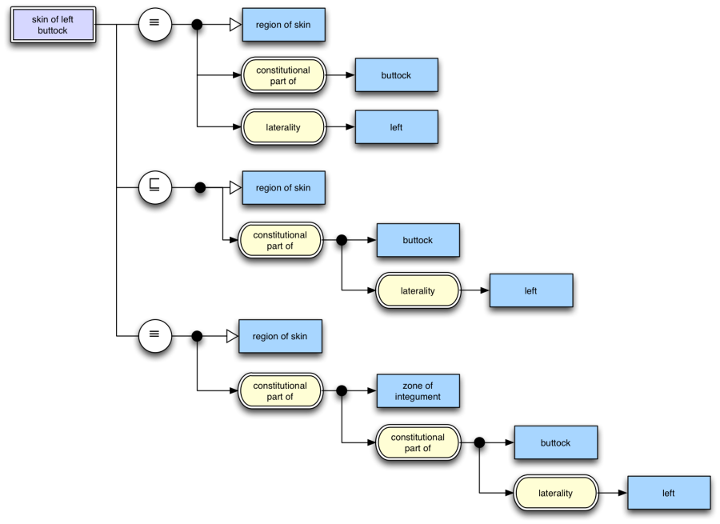

# 3.2 Concept Definition Diagrams

A more specific use of the diagramming notation is to represent the definition of a concept. This is consists of 

  * the concept whose definition is being shown at the top left,
  * connected to a series of one or more relational operators to an expression.

<figure><figcaption>
Figure 3.2-1: Concept definition diagram
</figcaption></figure>

In all cases a concept definition should be complete. That is, they should include all defining attributes. 

This can be used to represent "fully defined" concepts as follows:

<figure><figcaption>
Figure 3.2-2: Diagram of a fully defined concept
</figcaption></figure>

Primitive concepts may be represented as follows:

<figure><figcaption>
Figure 3.2-3: Primitive concept definition
</figcaption></figure>

The relationship between a concept and multiple expressions may also be represented, and in this manner multiple sets of attributes may be expressed. 

<figure><figcaption>
Figure 3.2-4: Concept definition including multiple sets in close to user form
</figcaption></figure>

Expressing multiple sufficient sets is not currently supported in SNOMED CT distribution content, however it may be in future, and regardless has utility in the diagramming notation and for this reason has been included. 

* * *
