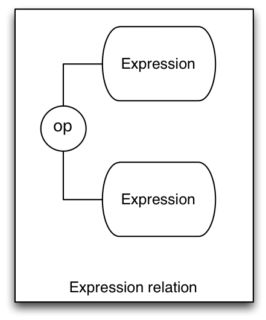
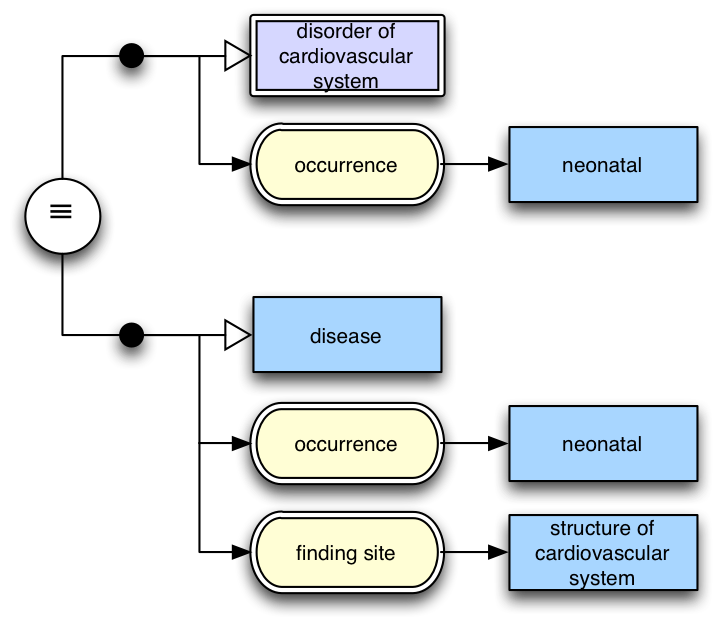
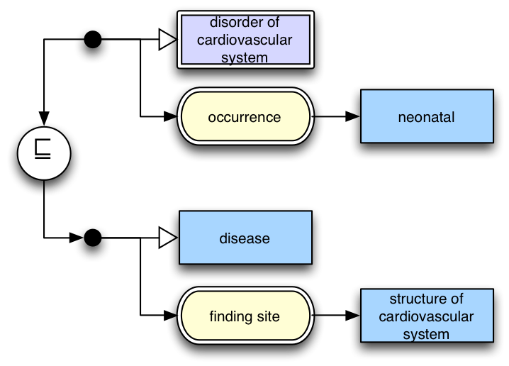
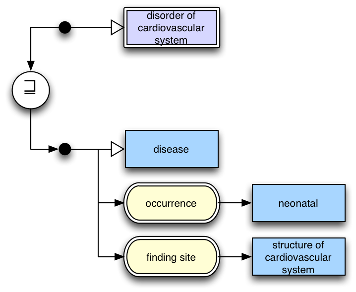

# 3.3 Expression Relation Diagrams

The diagramming notation described in this document can also be used to describe the relationship between two different SNOMED CT expressions. 

This is represented by two expression diagrams, one above the other, separated by a relational operator between. The diagram is read top to bottom. 

<figure><figcaption>
Figure 3.3-1: Expression relation diagram
</figcaption></figure>

As an example below is a diagram showing two expressions that are equivalent:

<figure><figcaption>
Figure 3.3-2: Diagram showing equivalence of two expressions
</figcaption></figure>

Note that in this example the equivalence relation connects the two expressions with lines – indicating that the relationship is bidirectional and can be read either way. 

<figure><figcaption>
Figure 3.3-3: _Ref347417159Figure 11 Diagram showing an expression subsumed by and other expression
</figcaption></figure>

Figure 3.3-4: shows an expression (top) subsumed by another expression (bottom). Note that arrows have been used to connect the expressions to the relational operator to indicate the direction it must be read.

<figure><figcaption>
Figure 3.3-5: _Ref347417377Figure 12 Diagram showing an expression that subsumes another expression
</figcaption></figure>

Figure 3.3-6: shows an expression (top) that subsumes an expression (bottom). Again note arrows have been used to indicate the direction this relationship must be read.

* * *
