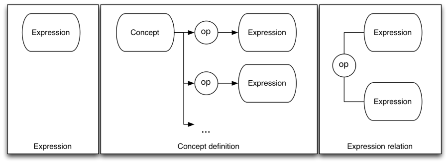

# 3 Diagram Types

The diagramming notation described in this document can be used to represent three types of information 

  * Expressions
  * Concept definitions
  * Expression relations

These different types of diagram are described in the following sections in detail, although they have the three different forms as shown below. 

<figure><figcaption>
Figure 3-1: Types of diagram
</figcaption></figure>

Note that in the diagram above

  * the elements labelled "Expression" are meant to represent expressions defined in the "Expression" diagram type (see 3.1). 
  * the element labelled "Concept" is a concept element as defined in section 4.1
  * the "op" element represents a relational operator as defined in section 4.5

Within this document "expression" refers to SNOMED CT expressions, which are

 _A structured combination of one or more concept identifiers used to express an instance of a clinical idea._

Each expression is composed of sub parts, which are often expressions in their own right, with a single concept value being the simplest type of expression. An "Expression Diagram" represents an expression value and is equivalent to a SNOMED CT expression. A "Concept Definition Diagram" is a series of statements defining a concept using one or more expressions to make these statements. An "Expression Relation Diagram" shows how the values of two expressions relate to one another. 

It is also worth noting that the current SNOMED CT Compositional Grammar [1](https://confluence.ihtsdotools.org/display/DOCDIAG/3+Diagram+Types#Footnote1 "Footnote: Click here to display the footnote") only has sufficient features to represent the left most diagram type – Expressions as defined in section 3.1. However the ability to represent the definition of a concept in terms of an expression, or show the relationship between two expressions, is useful in diagramming even though it may never be useful or included in the SNOMED CT Compositional Grammar. 

For this reason the diagramming guideline has been permitted to extend beyond the notation in the SNOMED CT Compositional Grammar for these two use cases. Aside from these cases  the diagramming guideline will remain synchronized with the capabilities of the SNOMED CT Compositional Grammar. 

Generally diagrams may be in one of the normal forms (short, long or distribution), or in stated form (for definitions) or close-to-user form (for expressions). To clearly indicate that a diagram represents a particular form it should labelled as such. Future versions of the Diagramming Guideline may include specific additional notation to indicate a diagram's form. 

Finally a fourth use case not formally covered in this document is interactive browsing diagrams rendered by software for navigating SNOMED CT content. While not currently formally covered in this document, Appendix C - Interactive browsing diagrams does explore this use case and options for future inclusion. 

* * *

Footnotes Ref | Notes  
---|---  
[1](https://confluence.ihtsdotools.org/display/DOCDIAG/3+Diagram+Types#FootnoteMarker1-0 "Footnote: Click to return to reference in text") |  The latest version of the SNOMED CT Compositional Grammar is available at <http://snomed.org/scg>. 
