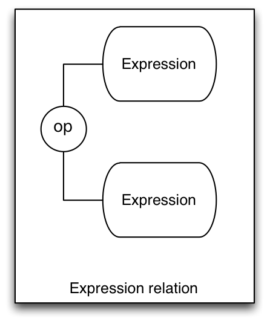
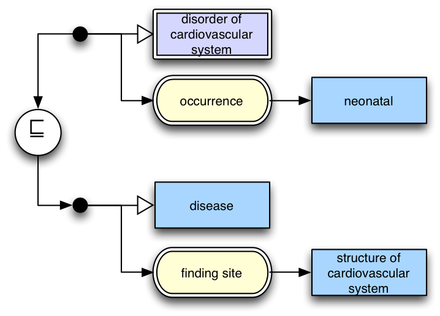
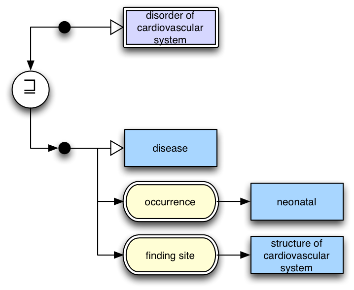

---
layout:
  width: default
  title:
    visible: true
  description:
    visible: true
  tableOfContents:
    visible: true
  outline:
    visible: true
  pagination:
    visible: true
  metadata:
    visible: true
---

# Diagram Types

The diagramming notation described in this document can be used to represent three types of information

* Expressions
* Concept definitions
* Expression relations

These different types of diagram are described in the following sections in detail, although they have the three different forms as shown below.

<figure><figcaption>
Figure 1: Types of diagram
</figcaption></figure>

Note that in the diagram above

* the elements labelled "Expression" are meant to represent expressions defined in the "Expression" diagram type (see 3.1).
* the element labelled "Concept" is a concept element as defined in section 4.1
* the "op" element represents a relational operator as defined in section 4.5

Within this document "expression" refers to SNOMED CT expressions, which are

_A structured combination of one or more concept identifiers used to express an instance of a clinical idea._

Each expression is composed of sub parts, which are often expressions in their own right, with a single concept value being the simplest type of expression. An "Expression Diagram" represents an expression value and is equivalent to a SNOMED CT expression. A "Concept Definition Diagram" is a series of statements defining a concept using one or more expressions to make these statements. An "Expression Relation Diagram" shows how the values of two expressions relate to one another.

It is also worth noting that the current [SNOMED CT Compositional Grammar](#user-content-fn-1)[^1] only has sufficient features to represent the left most diagram type – Expressions as defined in section 3.1. However the ability to represent the definition of a concept in terms of an expression, or show the relationship between two expressions, is useful in diagramming even though it may never be useful or included in the SNOMED CT Compositional Grammar.

For this reason, the diagramming guideline has been permitted to extend beyond the notation in the SNOMED CT Compositional Grammar for these two use cases. Aside from these cases the diagramming guideline will remain synchronized with the capabilities of the SNOMED CT Compositional Grammar.

Generally, diagrams may be in one of the normal forms (short, long or distribution), or in stated form (for definitions) or close-to-user form (for expressions). To clearly indicate that a diagram represents a particular form, it should be labelled as such. Future versions of the Diagramming Guideline may include specific additional notation to indicate a diagram's form.

Finally, a fourth use case not formally covered in this document is interactive browsing diagrams rendered by software for navigating SNOMED CT content. While not currently formally covered in this document, Appendix C - Interactive browsing diagrams does explore this use case and options for future inclusion.

***

## Expression Diagrams

<figure><figcaption>
Figure 2: Simple expression diagram
</figcaption></figure>

Expression diagrams are the most general form of diagram, which represent a SNOMED CT expression as defined in the SNOMED CT Compositional Grammar. Diagrams representing expressions may exist on their own, or be part of a larger diagram representing a concept definition or relation between two expressions.

In its simplest form this may simply be a single concept

<figure><figcaption>
Figure 3: Diagram of the single concept INLINE95617006 | Neonatal cyanosis |
</figcaption></figure>

In more complex scenarios diagrams may represent coordination of attribute types, concepts and concrete values.

<figure><figcaption>
<em>Figure 4 Expression equivalent Equivalent as at the January 2012 SNOMED CT International release</em> to I 95617006 | Neonatal cyanosis |
</figcaption></figure>

In all expressions other than a single concept value, it is necessary to start the diagram with a conjunction dot.

***

## Concept Definition Diagrams

A more specific use of the diagramming notation is to represent the definition of a concept. This consists of

* the concept whose definition is being shown at the top left,
* connected to a series of one or more relational operators to an expression.

<figure><figcaption>
Figure 5: Concept definition diagram
</figcaption></figure>

In all cases a concept definition should be complete. That is, they should include all defining attributes.

This can be used to represent "fully defined" concepts as follows:

<figure><figcaption>
Figure 6: Diagram of a fully defined concept
</figcaption></figure>

Primitive concepts may be represented as follows:

<figure><figcaption>
Figure 7: Primitive concept definition
</figcaption></figure>

The relationship between a concept and multiple expressions may also be represented, and in this manner multiple sets of attributes may be expressed.

<figure><figcaption>
Figure 8: Concept definition including multiple sets in close to user form
</figcaption></figure>

Expressing multiple sufficient sets is not currently supported in SNOMED CT distribution content, however it may be in future, and regardless has utility in the diagramming notation and for this reason has been included.

***

## Expression Relation Diagrams

The diagramming notation described in this document can also be used to describe the relationship between two different SNOMED CT expressions.

This is represented by two expression diagrams, one above the other, separated by a relational operator between. The diagram is read top to bottom.

<figure><figcaption>
Figure 9: Expression relation diagram
</figcaption></figure>

As an example, below is a diagram showing two expressions that are equivalent:

<figure><figcaption>
Figure 10: Diagram showing equivalence of two expressions
</figcaption></figure>

Note that in this example, the equivalence relation connects the two expressions with lines, indicating that the relationship is bidirectional and can be read either way.

<figure><figcaption>
Figure 11: Diagram showing an expression subsumed by and other expression
</figcaption></figure>

Figure 11 shows an expression (top) subsumed by another expression (bottom). Note that arrows have been used to connect the expressions to the relational operator to indicate the direction it must be read.

<figure><figcaption>
Figure 12: Diagram showing an expression that subsumes another expression
</figcaption></figure>

Figure 12 shows an expression (top) that subsumes an expression (bottom). Again, note that arrows have been used to indicate the direction this relationship must be read.

***

[^1]: The latest version of the SNOMED CT Compositional Grammar is available at [http://snomed.org/scg](http://snomed.org/scg).
