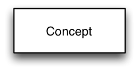

# 4.1 Concepts

  

Concepts are represented by a rectangle, containing the name of the concept as shown below:

  

<figure><figcaption>
The name used must be the concept's fully specified name or a synonym.
</figcaption></figure>

  

  

  

  

  

Optionally the definition status of a concept may be represented. Concepts that are fully defined may be represented using a double line border as shown below:

  

<figure><figcaption>
A rectangle with a single border is assumed to be primitive unless explicitly noted otherwise or it is clear in context (e.g., diagramming during a whiteboard discussion).
</figcaption></figure>

  

  

  

  

