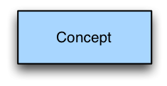
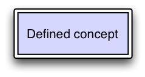
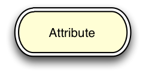
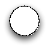

# 4.10 Colour

Diagrams may be produced in black and white, or colour may be added to aid readability.

In order to provide consistency the following sections specify the colours to be used for each type of element. Specified colours are websafe, do not affect black and white printing and are generally perceptible by most common colour blindness.

# Concepts

Primitive concepts are coloured with RGB 99CCFF (decimal 153, 204, 255) as shown below.

<figure><figcaption>
Defined concepts are coloured with RGB CCCCFF (decimal 204, 204, 255) as shown below.
</figcaption></figure>

<figure></figure>

# Attributes

Attributes are coloured with RGB FFFFCC (decimal 255, 255, 204) as shown below.

<figure></figure>

# Concrete Values

Concrete values are coloured with RGB A5E0B6 (decimal 165, 224, 182) as shown below.

# Attribute groups

Attribute groups are not coloured, and are always presented as a circle with a white interior.

<figure></figure>

# Conjunctions

Conjunctions are not coloured, and are always presented as a black dot as shown in [4.5 Conjunction](4.5-Conjunction_29950812.html).

# Relational Operators

Relational operators are not coloured and are always represented as shown in [4.6 Relational Operators](4.6-Relational-Operators_29950814.html).

* * *
