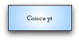
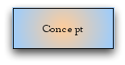

# 4.11 Gradients, blends and opacity

Graded shading provided by modern diagramming tools are NOT permitted as they

  * Can vary substantially in style
  * May reduce readability and consistency.

For example the following are not acceptable. 

<figure></figure>

<figure></figure>

<figure><figcaption>
<em> </em> *
</figcaption></figure>

