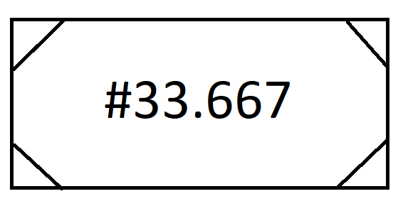

# 4.2 Concrete Values

A concrete value is represented by a rectangle with diagonal lines in the corners. The value itself is added to the rectangle as text, with numeric values (i.e. integers and decimals) preceded by a '#', string values enclosed in double quotes, and boolean values represented as "true" or "false" with no adornment.

## Number

<figure></figure>

<figure></figure>

## String 

<figure></figure>

  

  

