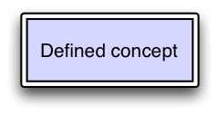
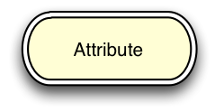
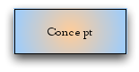

# Diagram Elements

This section describes the elements of the diagramming notation, including their shape/style and colour if applicable.

* [#concepts](4-diagram-elements.md#concepts "mention")
* [#concrete-values](4-diagram-elements.md#concrete-values "mention")
* [#attributes](4-diagram-elements.md#attributes "mention")
* [#attribute-groups](4-diagram-elements.md#attribute-groups "mention")
* [#conjunction](4-diagram-elements.md#conjunction "mention")
* [#relational-operators](4-diagram-elements.md#relational-operators "mention")
* [#arrow](4-diagram-elements.md#arrow "mention")
* [#line](4-diagram-elements.md#line "mention")
* [#names-and-element-sizes](4-diagram-elements.md#names-and-element-sizes "mention")
* [#colour](4-diagram-elements.md#colour "mention")
* [#gradients-blends-and-opacity](4-diagram-elements.md#gradients-blends-and-opacity "mention")
* [#fonts](4-diagram-elements.md#fonts "mention")

***

## Concepts

Concepts are represented by a rectangle, containing the name of the concept as shown below:

<figure><figcaption>
The name used must be the concept's fully specified name or a synonym.
</figcaption></figure>

Optionally the definition status of a concept may be represented. Concepts that are fully defined may be represented using a double line border as shown below:

<figure><figcaption>
A rectangle with a single border is assumed to be primitive unless explicitly noted otherwise or it is clear in context (e.g., diagramming during a whiteboard discussion).
</figcaption></figure>

***

## Concrete Values

A concrete value is represented by a rectangle with diagonal lines in the corners. The value itself is added to the rectangle as text, with numeric values (i.e. integers and decimals) preceded by a '#', string values enclosed in double quotes, and boolean values represented as "true" or "false" with no adornment.

## Number

<figure><figcaption></figcaption></figure>

<figure><figcaption></figcaption></figure>

## String

<figure><figcaption></figcaption></figure>

***

## Attributes

Relationships, or attributes, are represented using a rectangle with rounded ends and a double line border, as shown below:

<figure><figcaption>
A rounded rectangle with a single border is permitted in informal contexts (e.g., diagramming during a whiteboard discussion).
</figcaption></figure>

### "Is A" Arrows

"Is a" (subtype) relationships are highlighted by using an open-headed arrow as shown below:

<figure><figcaption>
The rounded rectangle specified in section 4.2 is omitted when representing "Is a" relationships, and the arrow head always points to the parent (super-type) concept.
</figcaption></figure>

***

## Attribute Groups

Attribute groups are represented with a circle:

<figure><figcaption></figcaption></figure>

***

## Conjunction

A conjunction is represented with a black "dot" (black filled small circle). It is only necessary when two or more attributes are being joined in a diagram. It is optional when attaching a single attribute.

<figure><figcaption></figcaption></figure>

***

## Relational Operators

Relational operators may be represented between expressions using the notation shown in the table below:

| Meaning           | Equivalent                                                                                  | Subsumed by                                                                                       | Subsumes                                                                                              |
| ----------------- | ------------------------------------------------------------------------------------------- | ------------------------------------------------------------------------------------------------- | ----------------------------------------------------------------------------------------------------- |
| Symbol            | 
<figure><figcaption></figcaption></figure>
 | 
<figure><figcaption></figcaption></figure>
 | 
<figure><figcaption></figcaption></figure>
 |
| Character         | <h4 id="id-4.6relationaloperators"><strong>≣</strong></h4>                                  | <h4 id="id-4.6relationaloperators"><strong>⊑</strong></h4>                                        | <h4 id="id-4.6relationaloperators"><strong>⊒</strong></h4>                                            |
| Unicode Character | 
Unicode: U+2263

UTF-8: E2 89 A3
                                                | 
Unicode: U+2291

UTF-8: E2 8A 91
                                                      | 
Unicode: U+2292

UTF-8: E2 8A 92
                                                          |

> The characters **≣, ⊑** and **⊒** are only present in fonts that support the full set of Unicode characters. For example users of Microsoft tools will find these characters in the font called "Arial Unicode MS".

***

## Arrow

An arrow as shown below is used to connect related elements where the connection is unidirectional:

<figure><figcaption>
Connecting arrows always have an arrow head at one end, and therefore have an explicit direction from one element to another in the direction the diagram should be read.
</figcaption></figure>

***

## Line

Similar to the Arrow above, the Line shown below is used to connect elements in the diagram where the connection is bi-directional.

<figure><figcaption></figcaption></figure>

***

## Names and Element Sizes

Each element contains a name as specified. The diagram elements may be resized and/or the text of the name given to the element may be wrapped as needed to achieve readability. When resizing it is highly recommended that concept and attribute elements remain rectangular and wider than they are tall where possible.

Names chosen must be fully specified names or (usually preferred) synonyms as stated, however a single diagram must consistently use either fully specified names or synonyms for all diagram elements.

It is highly recommended that an element's name be preceded by its concept identifier. This is to eliminate any potential ambiguity.

***

## Colour

Diagrams may be produced in black and white, or colour may be added to aid readability.

In order to provide consistency the following sections specify the colours to be used for each type of element. Specified colours are websafe, do not affect black and white printing and are generally perceptible by most common colour blindness.

### Concepts

Primitive concepts are coloured with RGB 99CCFF (decimal 153, 204, 255) as shown below.

<figure><figcaption>
Defined concepts are coloured with RGB CCCCFF (decimal 204, 204, 255) as shown below.
</figcaption></figure>

<figure><figcaption></figcaption></figure>

### Attributes

Attributes are coloured with RGB FFFFCC (decimal 255, 255, 204) as shown below.

<figure><figcaption></figcaption></figure>

### Concrete Values

Concrete values are coloured with RGB A5E0B6 (decimal 165, 224, 182) as shown below.

### Attribute groups

Attribute groups are not coloured, and are always presented as a circle with a white interior.

<figure><figcaption></figcaption></figure>

### Conjunctions

Conjunctions are not coloured, and are always presented as a black dot as shown in [#conjunction](4-diagram-elements.md#conjunction "mention").

### Relational Operators

Relational operators are not coloured and are always represented as shown in [#relational-operators](4-diagram-elements.md#relational-operators "mention")

***

## Gradients, Blends and Opacity

Graded shading provided by modern diagramming tools is NOT permitted, as they

* Can vary substantially in style
* May reduce readability and consistency.

For example, the following are not acceptable.

<figure><figcaption></figcaption></figure>

<figure><figcaption></figcaption></figure>

<figure><figcaption></figcaption></figure>

***

## Fonts

For consistency, all text within diagram elements is to use a sans-serif font such as "Helvetica[^1]" and font size is to be consistent across all elements within a single diagram.

Authors are also strongly encouraged to keep the apparent size of the text in the final image close to that of the surrounding text (usually 8-12 points).

***

[^1]: See [http://en.wikipedia.org/wiki/Helvetica](http://en.wikipedia.org/wiki/Helvetica)

<a href="https://docs.google.com/forms/d/e/1FAIpQLScTmbZIf0UEQwYDkY27EEWBkaiYkHSbR0_9DmFrMLXoQLyL7Q/viewform?usp=pp_url&entry.1767247133=SNOMED+Diagramming+Specification&entry.670899847=Diagram%20Elements" class="button primary">Provide Feedback</a>
