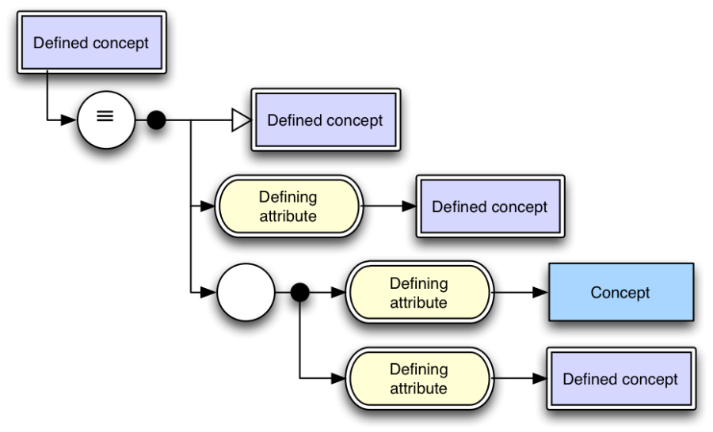

# 5 Layout

Diagrams are laid out and read top to bottom, left to right.

Orthogonal lines are used to connect elements; arrowheads, located on the end of lines pointing away from the line centre, indicate the direction to read the diagram.

Lines are preferred to run left to right, top to bottom, however other orientations are acceptable when required. Lines emanate from and connect to diagram elements at the top, bottom, left and right sides of the elements.

Attributes (rounded rectangles) must always have two lines connected to them, one with its arrowhead pointing at the attribute, the other with its arrowhead pointing at the concept that is the target of the attribute.

Where a single concept must appear multiple times on a diagram, authors are strongly encouraged to use SNOMED CT IDs and/or Fully Specified Names on the diagram to remove potential ambiguity. It is possible to render only one box per unique concept and connect multiple lines into that concept/s, however this is discouraged as it is likely to create difficult routing for lines and consequently poor readability.

<figure><figcaption>
Figure 5-1: - Diagram layout example
</figcaption></figure>

  

  

The elements should be ordered as follows, top to bottom:

  1. "Is-a" supertypes,
  2. ungrouped attributes,
  3. grouped attributes.

For finer grained ordering of relationships, the sort order defined in the Technical Implementation Guide should be used.

* * *

<a href="https://docs.google.com/forms/d/e/1FAIpQLScTmbZIf0UEQwYDkY27EEWBkaiYkHSbR0_9DmFrMLXoQLyL7Q/viewform?usp=pp_url&entry.1767247133=SNOMED+Diagramming+Specification&entry.670899847=5%20Layout" class="button primary">Provide Feedback</a>
