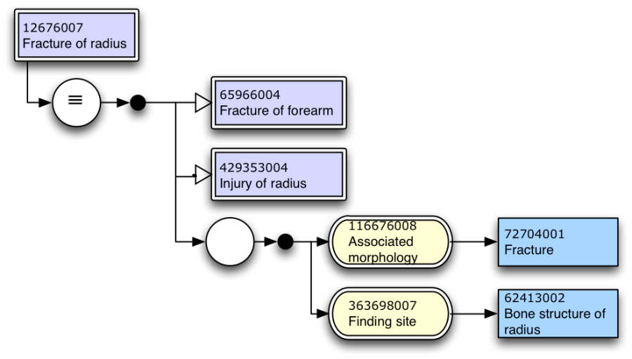
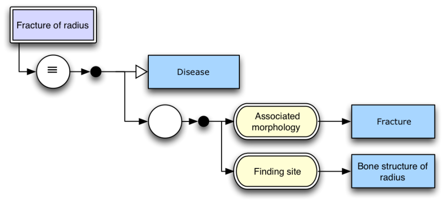

# Examples

This section shows some example uses, diagramming existing content from SNOMED CT.

<figure><figcaption>
<strong>Figure 25–Definition of</strong> [ 12676007 | Fracture of radius|](http://snomed.info/id/12676007 "12676007 | Fracture of radius |") <strong>in distribution normal form including identifiers</strong>
</figcaption></figure>

The concept definition shown in Figure 25 shows that the concept [`12676007 | Fracture of radius|`](http://snomed.info/id/12676007) is equivalent to the following distribution normal form expression -

[`429353004 |Injury of radius|`](http://snomed.info/id/429353004) `+` [`65966004 |Fracture of forearm|`](http://snomed.info/id/65966004) `:`\
`{` [`116676008 |Associated morphology|`](http://snomed.info/id/116676008) `=` [`72704001 |Fracture|`](http://snomed.info/id/72704001) `,`\
[`363698007 |Finding site|`](http://snomed.info/id/363698007) `=` [`62413002 |Bone structure of radius|`](http://snomed.info/id/62413002) `}`

<figure><figcaption>
<strong>Figure 26–Definition of</strong> [ 12676007 | Fracture of radius|](http://snomed.info/id/12676007 "12676007 | Fracture of radius |") <strong>in long normal form without identifiers</strong>
</figcaption></figure>

Figure 26 shows the definition of `| 12676007 | Fracture of radius |` again, however, this time in long normal form and without identifiers. The expression on the right had side of the diagram equates to the text expression - `| 64572001 | Disease | : {116676008 | Associated morphology | = 72704001 | Fracture |, 363698007 | Finding site | = 62413002 | Bone structure of radius |}`

***
