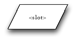
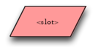
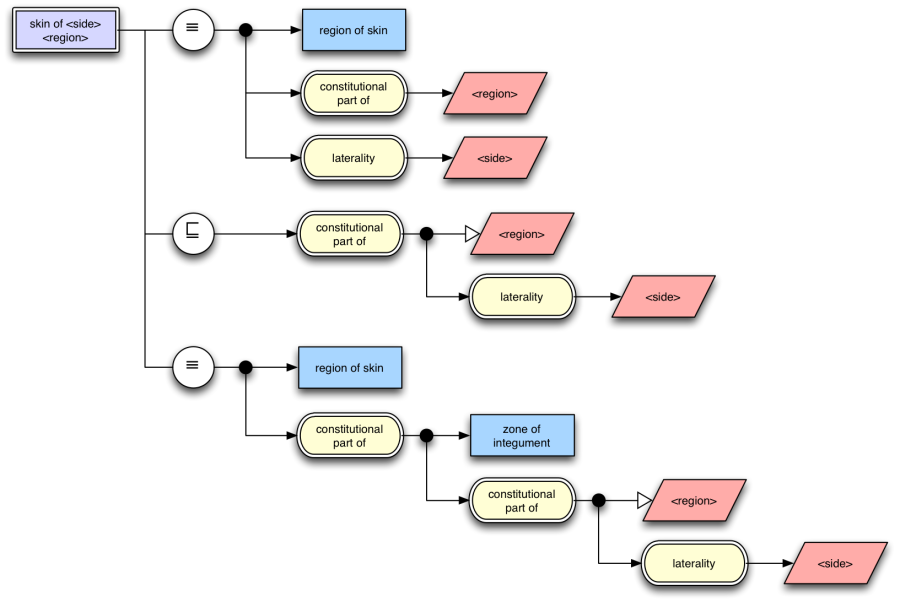

# appendix-a-template-expressions

## Appendix A - Template Expressions

This appendix describes potential future changes designed to support template expressions. That is, expressions with predefined variables which when assigned values populate the expression.

As these are potential future extensions, this section is not a normative part of this document. It exists to gather feedback on proposed handling of template expressions. Once appropriate extensions are made to the SNOMED CT Compositional Grammar to support template extensions this section will be updated with feedback and moved to the normative part of this document.

## Slots

For diagrams representing a template expression or definition, it is possible to represent "slots" which represent a placeholder a concept can fill when the template is used (see A.3). Slots are expressed using a parallelogram as shown below. The name of the slot can be considered like a variable for replacement and is surrounded by angle brackets "<" and ">".

<figure><figcaption></figcaption></figure>

## Color for Slots

Slots as described in section A.1 are optionally coloured with RGB FF9999 (decimal 255, 153, 153) as shown below:

<figure><figcaption></figcaption></figure>

## Concept Definition Template Diagrams

Using the "slot" element described in A.1 it is possible to define diagrams that represent a template for concept definition or expressions. It is then possible to use this template to create concepts or expressions by filling the "slots" with appropriate concepts.

<figure><figcaption>
Figure Appendix A-1: Example template diagram using "slots"
</figcaption></figure>

These template diagrams are a specialisation of concept definition diagrams as described in section 3.2; however some of the attribute value concepts are replaced by "slots" making the definition general and reusable.

Note the names provided for the "slots" are enclosed in angle brackets "<" and ">". These slot names are inserted into the name of the concept in the top left of the diagram.

The names associated with slots operate as unique variable names for a diagram or set of diagrams. When populated, every slot with the same name on a diagram, or set of related diagrams, receives the same concept value associated with that slot name. Unless all slots names used are assigned concept values, the expression is not complete.
