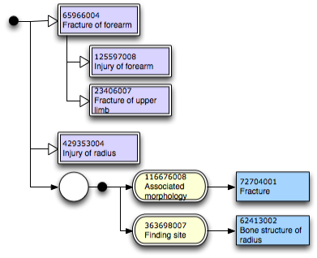
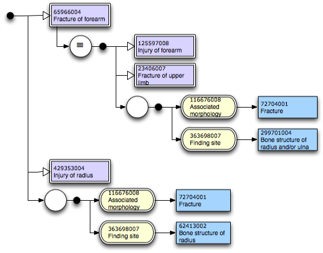

# Appendix B - Additional Context

Earlier versions of the Diagramming Guideline included a section on providing additional context for concepts in diagrams - that is expanding concepts on diagrams to provide further information or context to a diagram.

These approaches, while potentially useful, also increase complexity and introduce the possibility of ambiguity and misinterpretation, and have therefore been omitted from the Diagramming Guideline. Feedback from readers is sought for future versions of the Diagramming Guideline, at present this appendix includes the two forms of additional context previously proposed to elicit feedback.

## Concept Parents

A concepts parents may be added to a diagram for context using "Is a" relationships as shown in section 4.2.1. For example in the following diagram the parents of 6596004 | Fracture of forearm | have been added as extra context:

<figure><figcaption>
Figure Appendix B-1: expression showing an included concept's parent concepts as context
</figcaption></figure>

Note that this in no way changes the meaning of the diagram, which represents the expression

`429353004 |Injury of radius| + 65966004 |Fracture of forearm| :`\
`{ 116676008 |Associated morphology| = 72704001 |Fracture| ,`\
`363698007 |Finding site| = 62413002 |Bone structure of radius| }`

## Full Concept Definition

The full definition of a concept may be added to the diagram to provide additional context for readers. Below is a diagram of the same expression used in section B.1, however this time the full definition of 6596004 | Fracture of forearm | has been provided:

<figure><figcaption>
Figure Appendix B-2: expression showing an included concept's definition as context
</figcaption></figure>

## Clarifying Additional Context

A further suggested visual clarification to either approach specified in sections B.1 and B.2 is to use

* a dotted/dashed box around the segments of the diagram providing "additional context"
* and/or change connectors in segments reflecting "additional context" to use dotted or dashed lines

Is a complementary, not a competing, proposal to those specified in sections B.1 and B.2.
