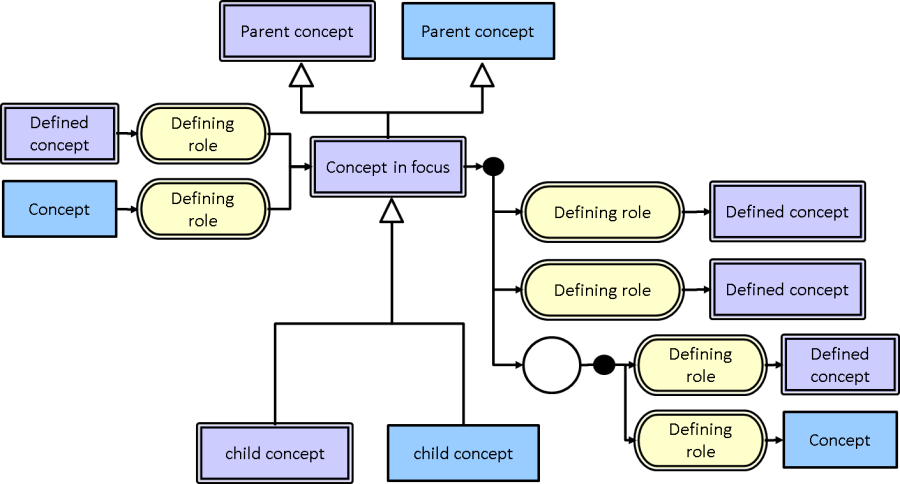
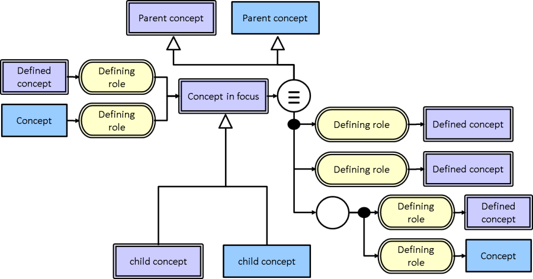
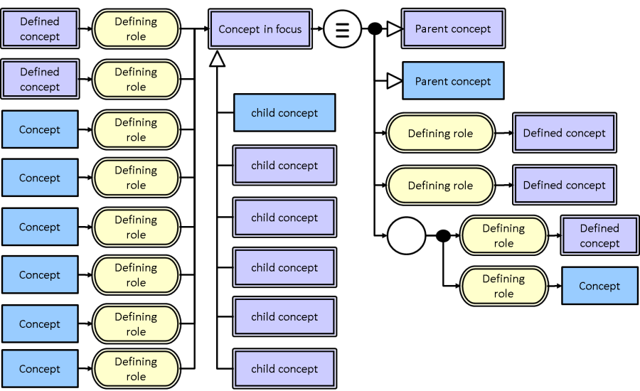

# Appendix C - Interactive Browsing Diagrams

[3-diagram-types.md](../3-diagram-types.md "mention") explores three different forms of diagram for expressing

* Expressions
* Concept definition
* Expression relation

This appendix explores a fourth type of diagram, essentially an extended use of the "Concept definition" diagram for use specifically in rendering interactive diagrams to navigate and explore SNOMED CT content.

This specific case is not included in the formal Diagramming Guideline at present, as it requires further exploration to be specified. However it may also be determined that there are multiple differing renderings that are useful in different browsing scenarios, and therefore one or a finite number of diagram styles may not be possible to define.

The following sections and examples are intended to demonstrate alternate layouts useful for browsing use cases, in an effort to elicit feedback and explore this scenario.

## Abbreviated concept definition

Figure Appendix C-1: depicts a concept definition diagram as used in the Workbench Utilities at the time of writing.

The most distinguishing feature of this approach is the removal of the "equivalence" symbol as an abbreviation. This enables the concept's parents to appear above the "concept in focus" while attributes appear on the right without excess clutter (as depicted in Figure 31).

Note that this diagram also includes child concepts of the "concept in focus" below, and attributes of which the "concept in focus" is a target on the left. This results in

* The arrows emanating from the "concept in focus" showing the definition of the "concept in focus"
* The arrows entering the "concept in focus" showing where the "concept in focus" is used in the definition of other concepts.

<figure><figcaption>
Figure Appendix C-2: abbreviated browsing concept definition diagram
</figcaption></figure>

## Unabbreviated concept definition

Figure Appendix C-3: depicts an alternate representation to that shown in Figure 30, where the "equivalence" symbol has not been abbreviated.

This approach is it conforms to the concept definition form in section 3.2; however it does present a more cluttered diagram than the abbreviated form in Figure 30.

<figure><figcaption>
Figure Appendix C-4: unabbreviated browsing concept definition diagram
</figcaption></figure>

## Alternative Unabbreviated Concept Definition Layout

Figure Appendix C-5: shows an alternative layout of Figure 31. This layout uses the same layout used in 3.2 for the definition of the "concept in focus" - parent concepts shown on the right hand side.

This is matches the representation in 3.2, and achieves more space for rendering where the "concept in focus" is used in the definition of other concepts. However the resulting diagram is less intuitive than displaying the focus concept's parents above the focus concept.

<figure><figcaption>
Figure Appendix C-6: alternative unabbreviated browsing concept definition diagram
</figcaption></figure>

## Alternative Views

The diagram options in this appendix have been largely focussed on a concept definition centric interaction/navigation; however there are other focuses that may also be useful.

For example it is common to consider browsing or navigating SNOMED CT purely from its sub/supertype relationships in a full hierarchical view back to the root node. While the examples in this section do provide immediate parents, sometimes hierarchical views showing full lineage are useful. However given the real-estate requirements of full lineage and full concept definition, it is unlikely that both renderings can coexist on the same diagram concurrently. Consequently an alternate style may be required for this view, of which there are many examples in SNOMED CT browsers at present.

Another example scenario is browsing a reference set/s or SNOMED CT content in context of a reference set/s. Again this use case is likely sufficiently at odds with the examples provided in this appendix that an alternate diagram style is required.

As this Diagramming Guideline is focussed on expressions and concept definitions, these and other potential views are out of scope and as yet unexplored formally by this document. Many examples of these renderings exist in the numerous SNOMED CT browsers, and may be left unspecified for the continued innovation of browser vendors, or explored in future versions of the Diagramming Guidelines if considered worthwhile.

<a href="https://docs.google.com/forms/d/e/1FAIpQLScTmbZIf0UEQwYDkY27EEWBkaiYkHSbR0_9DmFrMLXoQLyL7Q/viewform?usp=pp_url&entry.1767247133=SNOMED+Diagramming+Specification&entry.670899847=Appendix%20C%20-%20Interactive%20Browsing%20Diagrams" class="button primary">Provide Feedback</a>
