# Appendix D - Technical Implementation Guide Examples

The following diagrams show examples taken from the SNOMED CT Technical Implementation Guide January 2013, redrawn using the notation specified in this document. If approved it is anticipated that the diagrams in the SNOMED CT Technical Implementation Guide would be replaced by the examples shown in this section.

For convenience the figure number and original diagram from the SNOMED CT Technical Implementation Guide have been included in this section.

Note that the diagrams drawn in this section are an exact copy of the diagrams from the SNOMED CT Technical Implementation Guide as at January 2013. Some of the concepts represented in the diagrams do not appear in the actual SNOMED CT January 2013 content; however this has been faithfully copied from the current diagrams in the SNOMED CT Technical Implementation Guide.

_Figure 21: Refining a concept to add specificity_ from the SNOMED CT Technical Implementation Guide section 4.2.2.3.3

<figure>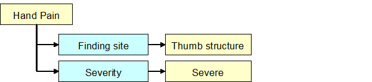<figcaption>
Figure Appendix D-1: SNOMED CT TIG section 4.2.2.3.3 Figure 21
</figcaption></figure>

Would be redrawn as

<figure>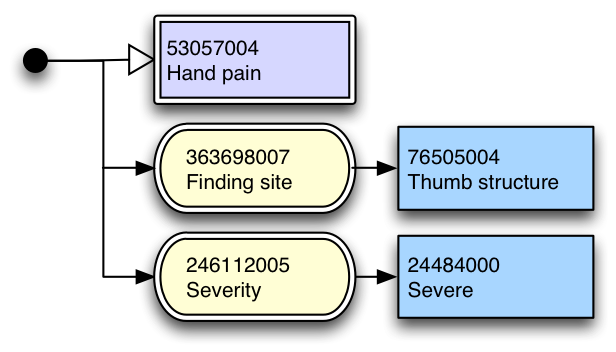<figcaption>
Figure Appendix D-2: Redrawn Figure 21 from the SNOMED CT TIG section 4.2.2.3.3
</figcaption></figure>

Note that the redrawn expression diagram is distinguishable from a concept definition of "hand pain" - under the notation specified in this document concept definitions are rendered differently.

Figure Appendix D-3: Nested refinement applied to a body site from the SNOMED CT Technical Implementation Guide section 4.2.2.3.3

<figure>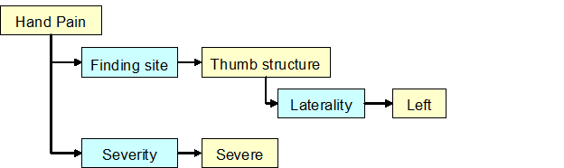<figcaption>
Figure Appendix D-4: SNOMED CT TIG section 4.2.2.3.3 Figure 22
</figcaption></figure>

Would be redrawn as

<figure>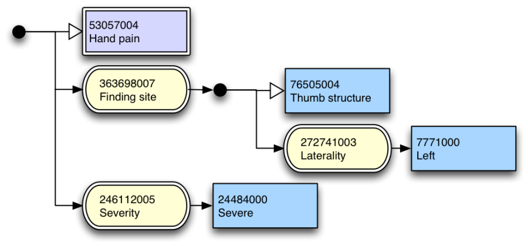<figcaption>
Figure Appendix D-5: Redrawn Figure 22 from the SNOMED CT TIG section 4.2.2.3.3
</figcaption></figure>

Figure Appendix D-6: Grouped refinement from the SNOMED CT Technical Implementation Guide section 4.2.2.3.3

<figure>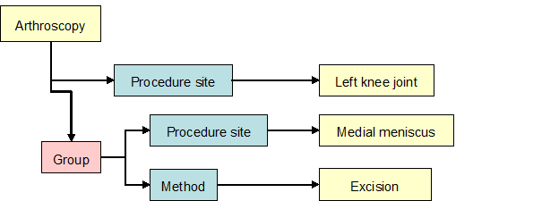<figcaption>
Figure Appendix D-7: SNOMED CT TIG section 4.2.2.3.3 Figure 23
</figcaption></figure>

Would be redrawn as

<figure>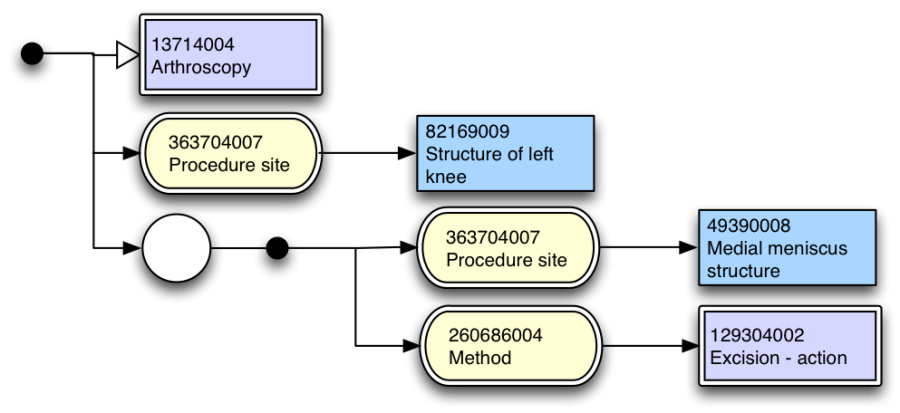<figcaption>
Figure Appendix D-8: Redrawn Figure 23 from the SNOMED CT TIG section 4.2.2.3.3
</figcaption></figure>

Figure Appendix D-9: An expression with two focus concepts from the SNOMED CT Technical Implementation Guide section 4.2.2.3.4

<figure>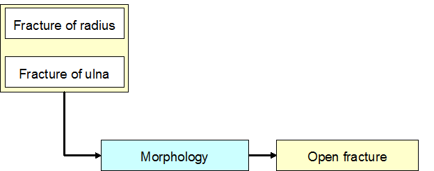<figcaption>
Figure Appendix D-10: SNOMED CT section 4.2.2.3.4 Figure 24
</figcaption></figure>

Would be redrawn as

<figure>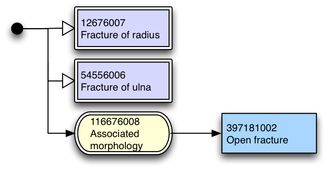<figcaption>
Figure Appendix D-11: Redrawn Figure 24 from the SNOMED CT TIG section4.2.2.3.4
</figcaption></figure>

_Figure 25_ _An_ _alternative view of an expression with two focus concepts_ from the SNOMED CT Technical Implementation Guide section 4.2.2.3.4

<figure>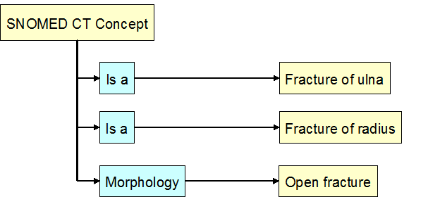<figcaption>
Figure Appendix D-12: SNOMED CT TIG section 4.2.2.3.4 Figure 25
</figcaption></figure>

Figure Appendix D-13: Would be drawn little different to the previous example for Figure 24 An expression with two focus concepts as

<figure>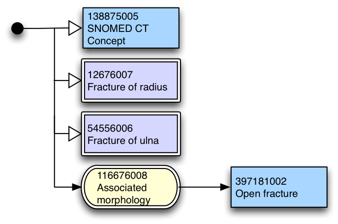<figcaption>
Figure Appendix D-14: Redrawn Figure 25 from SNOMED CT TIG section 4.2.2.3.4
</figcaption></figure>

_Figure 26_ _Family history of a specific type of severe allergy to nuts as close-to-user form expression_ from the SNOMED CT Technical Implementation Guide section 4.2.2.3.5

<figure>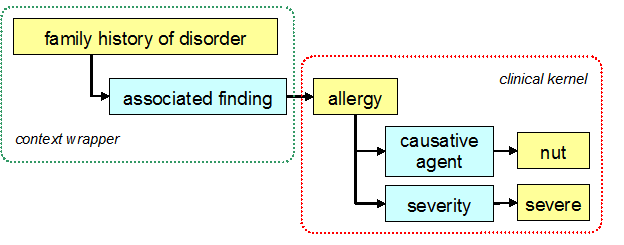<figcaption>
Figure Appendix D-15: SNOMED CT TIG section 4.2.2.3.5 Figure 26
</figcaption></figure>

Would be redrawn as

<figure>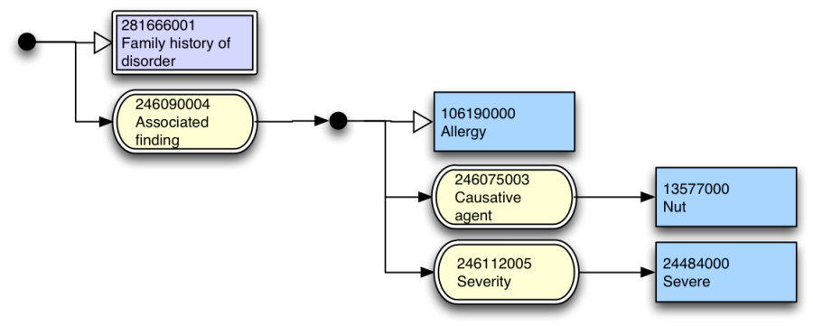<figcaption>
Figure Appendix D-16: Redrawn Figure 26 from the SNOMED CT TIG section 4.2.2.3.5
</figcaption></figure>

_Figure 27_ _Family history of severe allergy to nuts represented by using a context wrapper expression_ from the SNOMED CT Technical Implementation Guide section 4.2.2.3.5

<figure>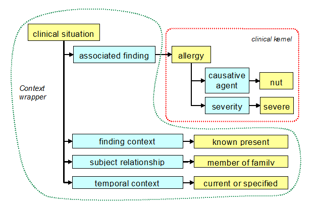<figcaption>
Figure Appendix D-17: SNOMED CT TIG section 4.2.2.3.5 Figure 27
</figcaption></figure>

Would be redrawn as

<figure>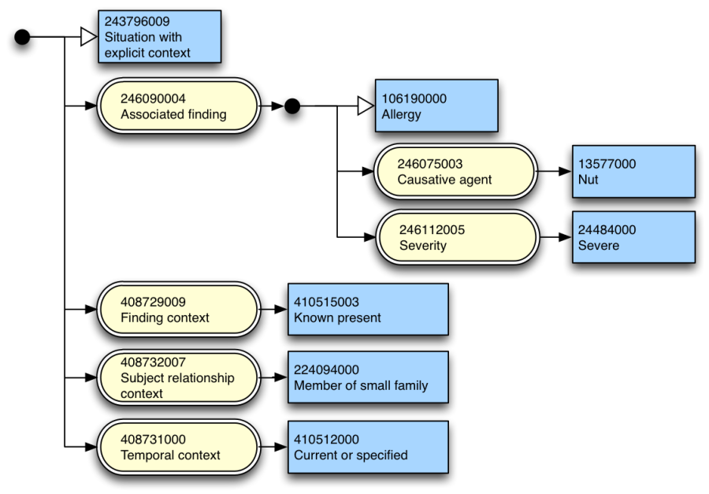<figcaption>
Figure Appendix D-18: Redrawn Figure 27 from SNOMED CT TIG section 4.2.2.3.5
</figcaption></figure>

\*\*

\*\*
